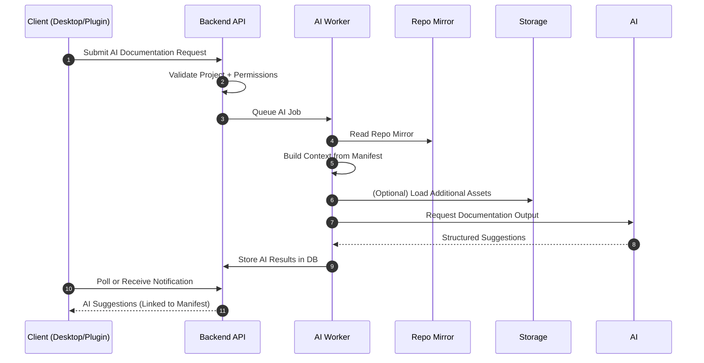
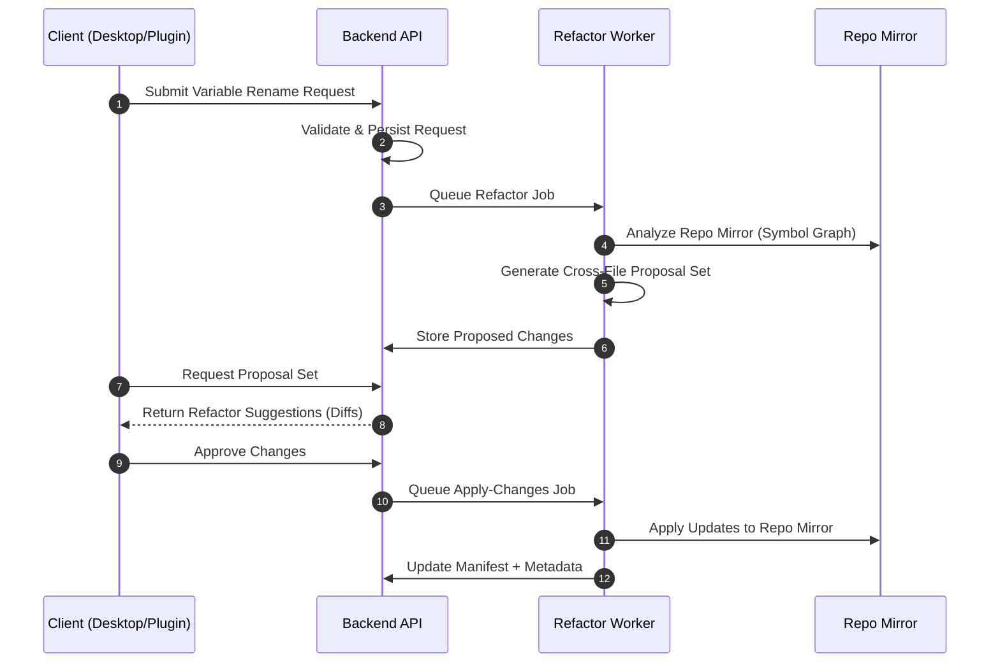
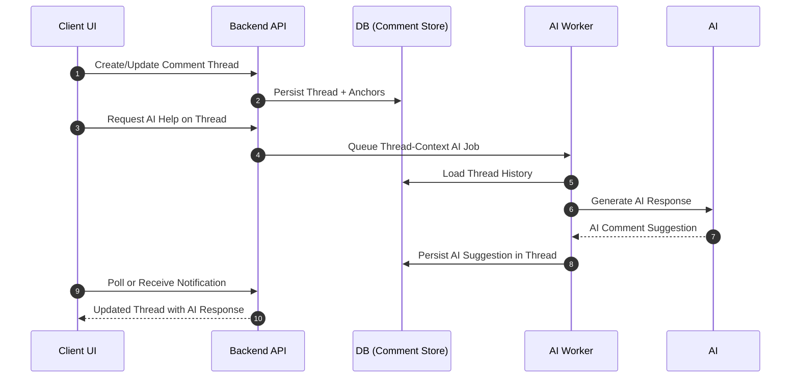
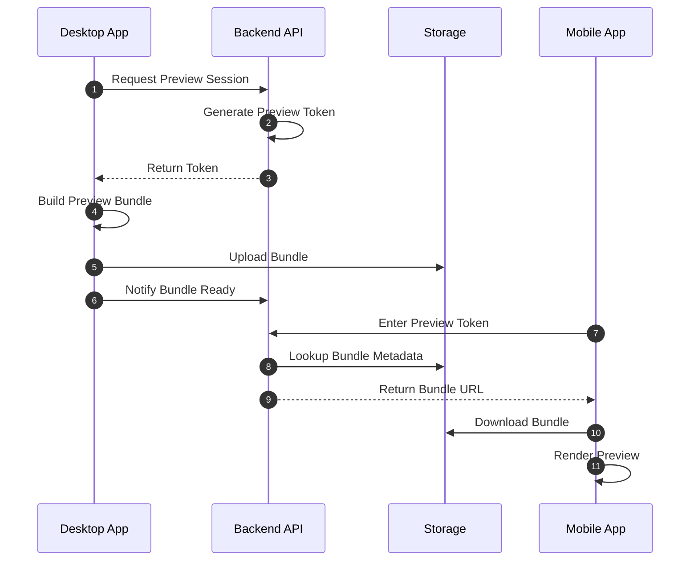
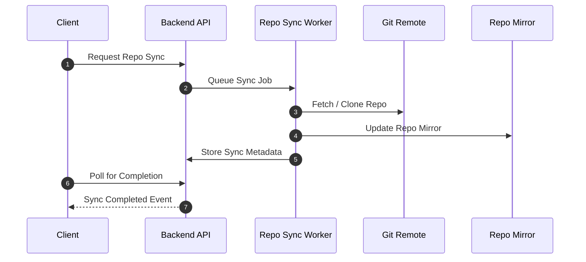
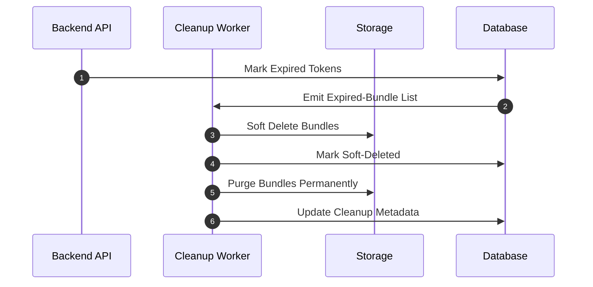
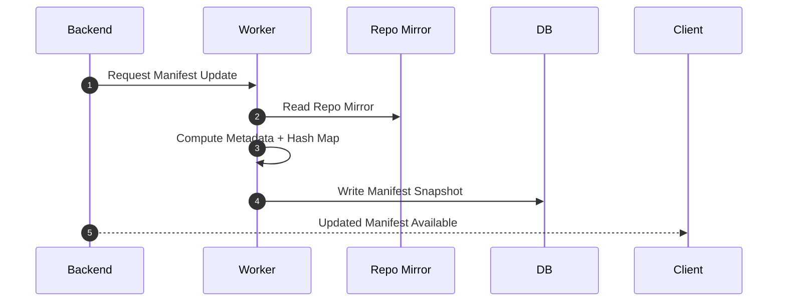
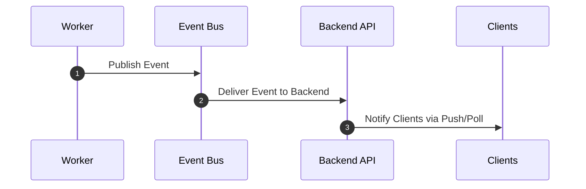

# Data Flow Diagrams

This document contains the full set of expanded, unified, and consistently formatted data‑flow diagrams for HiveSync. All diagrams have been updated to reflect the restored concepts (Project Manifest, comment threading, multi‑file AI refactor pipeline, future messaging backbone, and multi‑stage preview cleanup). All Mermaid diagrams are included in fully expanded form.

---

# 1. AI Documentation Flow

---

# 2. Multi‑File Variable Rename / Refactor Flow

---

# 3. Comment Threading & AI Documentation Thread Flow

---

# 4. Preview Flow (Desktop → Backend → Mobile)

---

# 5. Repo Sync Flow

---

# 6. Multi‑Stage Preview Cleanup Flow

---

# 7. Project Manifest Generation Flow

---

# 8. Future Messaging Backbone (Placeholder Diagram)

---

*(End of file)*
