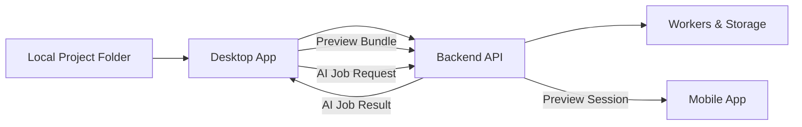

# Desktop Architecture

## 1. Overview

The HiveSync desktop app is the **primary control center** for developers. It is where most authoring actions happen:

- Linking local folders to HiveSync projects and repos.
- Triggering repo syncs and AI documentation jobs.
- Building and sending preview bundles to mobile devices.
- Reviewing AI suggestions in depth.
- Managing basic account and project settings.

Unlike the mobile app (which is primarily a preview consumer), the desktop app is a **full-featured orchestration client** that drives the core workflows exposed by the backend.

This document describes the overall architecture of the desktop app, how its modules are structured, and how it interacts with the backend and local filesystem.

---

## 2. Technology Stack

The desktop client is assumed to be built using:

- **Electron** (or similar desktop shell) for cross-platform Windows/macOS/Linux support.
- **TypeScript + React** for UI.
- **Node.js** in the main process for filesystem and child process management.
- **IPC channels** between the Electron main process and renderer processes for controlled privileged operations.

The desktop app heavily leverages the same design system and interaction patterns as the web and mobile experiences where possible.

---

## 3. High-Level Responsibilities

The desktop app is responsible for:

- **Project mapping** – associating on‑disk folders with HiveSync projects (see `desktop_project_mapping.md`).
- **Repo operations** – configuring remote repo info and triggering backend repo syncs (backend does the actual git operations).
- **AI workflows** – selecting files or diffs, sending AI jobs, and presenting suggestions.
- **Preview bundle creation** – building or packaging preview bundles and uploading them to the backend (see `desktop_build_and_bundle_pipeline.md` and `desktop_preview_sender.md`).
- **Notifications and status** – showing job completion, preview readiness, errors, etc.
- **Settings** – account management, backend URL configuration, feature flags, and diagnostics.

Anything requiring long-running operations (like repo sync or AI work) is ultimately delegated to the backend and workers; the desktop app remains primarily a coordinator and UI shell.

---

## 4. Process Model

The desktop app uses two major processes:

- **Main process**:
  - Manages application lifecycle (launch, quit, auto-update hooks).
  - Owns system-integrated menus, tray icons, and OS-level behaviors.
  - Performs privileged operations:
    - Launching local build tools (CLI calls, Node scripts).
    - Accessing local file system paths required for building bundles.
  - Provides a controlled IPC API to renderer processes.

- **Renderer process (UI)**:
  - Runs React UI.
  - Handles navigation, state management, and presentation.
  - Calls into the backend via HTTP.
  - Requests privileged operations via IPC to the main process.

This separation ensures that untrusted UI code does not directly perform filesystem or process operations.

---

## 5. Module Layout (Renderer/UI)

The renderer code is organized into modules analogous to the mobile app but with richer functionality:

- `auth/` – login screen, session handling, token storage.
- `projects/` – project list, details, mapping to local folders.
- `files/` – file tree views, diff viewers, file selection for AI jobs.
- `ai/` – AI job creation dialogs and suggestion reviewers.
- `preview/` – preview session creation, local build status, and sending bundles.
- `notifications/` – centralized notification list and in‑UI toasts/banners.
- `settings/` – per-user and per-project configuration panels.
- `core/` – shared utilities (HTTP client, IPC wrapper, global state, theming).

Each module defines its own routes, components, and hooks, while depending on a small set of shared infrastructure utilities.

---

## 6. Data Flow Overview

At a high level, desktop data flows look like this:

- **Local project folder**: Source files on the developer’s machine.
- **Desktop app**: Reads local files as needed, but does not store long-term state about them beyond metadata and configuration.
- **Backend API & workers**: Host the canonical project state, mirrors, AI job processing, and preview session management.
- **Mobile app**: Consumes preview sessions generated by the desktop.

---

## 7. State Management (UI)

The desktop UI maintains several layers of state:

- **Session state** – current user, active project, selected environment (dev/stage/prod endpoints if used).
- **Project state** – known projects, local folder mappings, last sync times.
- **AI state** – queued and completed jobs, selected suggestions, filters in the review panes.
- **Preview state** – active preview session, preview token, local build status, logs.
- **UI state** – current layout (which side panels are open), theme, and view selections.

A single predictable state management approach (e.g., Redux, Zustand, or React context) keeps this manageable and testable.

---

## 8. Security and Permissions (Desktop-Side)

Desktop must protect:

- Authentication tokens.
- Project configuration.
- Local filesystem operations.

Key principles:

- Store JWTs in an encrypted, OS-native credential store where possible.
- IPC channels must be narrowly scoped and validated; renderer cannot send arbitrary shell commands.
- Local builds and bundle creation run in child processes with limited privileges (no direct access to secrets beyond what is necessary to perform the build).
- Logs must not include secrets (tokens, passwords) or large chunks of user code unless explicitly opted into debug mode.

Backend-side security is documented in `security_model.md`; this section focuses on client‑side constraints and correct use of the backend.

---

## 9. Extensibility

The desktop architecture supports future enhancements such as:

- Deeper integration with local tools (e.g., IDEs and build systems).
- Pluggable preview build strategies per framework (React Native, Flutter, etc.).
- Advanced AI tools such as semantic search, code explainers, or refactoring flows.
- Project‑specific configuration for previews and AI (stored and managed via backend APIs).

New features should integrate into existing modules (e.g., `preview/`, `ai/`, `projects/`) and reuse existing HTTP and IPC infrastructure rather than creating one‑off paths.

---

## 10. Relationship to Other Docs

- `desktop_runtime_overview.md` – main vs renderer processes, IPC details, packaging.
- `desktop_preview_sender.md` – preview session creation and bundle upload in detail.
- `desktop_project_mapping.md` – how local folders connect to backend projects.
- `desktop_build_and_bundle_pipeline.md` – local build pipeline and bundle creation.
- `desktop_ui_layout.md` – window, panel, and navigation layout.
- `desktop_api_usage.md` – backend endpoints used by the desktop.
- `desktop_cache_and_storage.md` – how local caches and settings are stored.
- `desktop_error_model.md` – mapping of backend errors and build failures to UI.
- `desktop_notifications_module.md` – desktop notifications and system tray integration.
