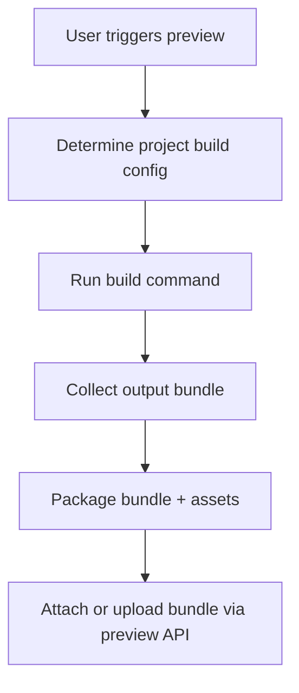

# Desktop Build and Bundle Pipeline

## 1. Overview

The build and bundle pipeline produces artifacts suitable for mobile preview. It is executed locally on the developer’s machine, triggered by the desktop app, and tailored to the project’s framework/tooling.

---

## 2. Conceptual Pipeline

Key phases:

- Configuration.
- Build execution.
- Artifact collection.
- Packaging.
- Upload/attach.

---

## 3. Build Configuration

Each project may specify:

- A build command (e.g., `npm run hivesync:bundle`).
- A working directory (root of project).
- Expected output path(s) for bundle artifacts.
- Optional environment variables or flags.

The desktop app reads this configuration from:

- A local project config file (e.g., `.hivesync.json`), and/or
- Backend‑stored project settings.

Fallbacks should be sensible (e.g., prompts or templates for common frameworks).

---

## 4. Command Execution

The build command is executed by the desktop main process as a child process:

- Standard output and error are captured.
- Exit code is monitored:
  - `0` → success.
  - non‑zero → failure.

Logs are made available to the user in a “Build Output” panel.

---

## 5. Artifact Collection and Packaging

On successful build:

- The desktop app locates the output artifact(s):
  - Single JS bundle file.
  - Optional asset directory.
- These may be:
  - Uploaded as a single archive (zip).
  - Uploaded as a raw file (if the backend expects a specific format).
  - Referenced by URL (dev server mode, in which case packaging is minimal).

If packaging fails (files not found, bad path), the desktop should:

- Report a clear error.
- Suggest verifying the build config.

---

## 6. Integration with Preview API

After packaging, the pipeline hands off the bundle info to the preview sender:

- For file upload: call `POST /preview/sessions/{token}/bundle` with the archive.
- For dev server: call with `bundle_url` pointing to the running server.

Any upload failures are surfaced in the same “Preview Build” panel alongside build logs.

---

## 7. Framework-Specific Profiles (Future)

A future extension may provide presets for:

- React Native / Expo.
- Flutter.
- Native mobile frameworks with exportable preview builds.

These profiles would:

- Predefine typical build commands and paths.
- Reduce setup friction.
- Still allow advanced configuration overrides.
