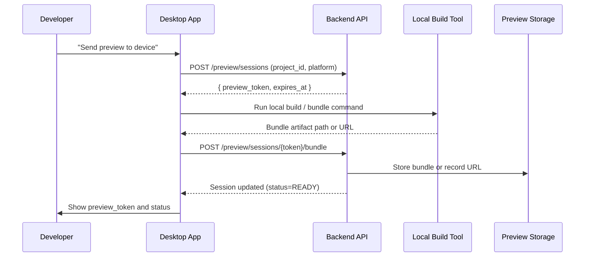

# Desktop Preview Sender

## 1. Overview

The desktop preview sender is responsible for:

- Creating preview sessions via the backend.
- Building or selecting preview bundles for a given project.
- Uploading or attaching bundles to the preview session.
- Presenting the resulting preview token to the user for entry on mobile.

This document focuses on the desktop‑side behavior; complementary backend details are in `preview_bundle_api.md`.

---

## 2. High-Level Flow

---

## 3. Session Creation

When the user initiates a preview from the UI:

1. Desktop calls `POST /preview/sessions` with:
   - `project_id`
   - `platform` (`ios`, `android`, or other future targets)
2. Backend returns:
   - `preview_token`
   - `expires_at`
   - Initial `status=PENDING`

The desktop app surfaces the token immediately in the UI and may copy it to the clipboard for convenience, even before the build is complete.

---

## 4. Local Build / Bundle Creation

Depending on the project type, the local build step may:

- Run a framework‑specific build command (e.g., `npm run hivesync:bundle`).
- Run a generic script configured per project (e.g., `hivesync.buildCommand` in project settings).
- Invoke a Node.js script that prepares a JS bundle and asset manifest.

The build step is typically executed in a child process launched by the desktop main process. Build output and logs are captured and used to:

- Show progress (if feasible).
- Populate logs shown in a “Preview Build” panel.
- Provide error messages if the build fails.

On success, the desktop app ends up with either:

- A **file path** pointing to a local bundle artifact, or
- A **URL** for a dev server (development mode only).

---

## 5. Upload / Attach Bundle

Once a bundle is available:

- For **file uploads**:
  - Desktop calls `POST /preview/sessions/{token}/bundle` with a multipart form containing the bundle file.
- For **dev‑server URLs**:
  - Desktop calls the same endpoint but passes a JSON body with `bundle_url` instead of uploading a file.

The backend handles storage or recording of the bundle location and updates `preview_sessions` status to `READY` if successful.

Desktop monitors the response and updates its local view of the session state.

---

## 6. Status Feedback to User

The desktop app must provide clear feedback to the user at each step:

- **Session created**:
  - Show the token, status `Waiting for bundle`, and expiration time.
- **Build in progress**:
  - Show a spinner or progress indicator alongside logs.
- **Bundle upload success**:
  - Mark session `READY` in the UI.
  - Suggest to the user: “Enter this token on your mobile app.”
- **Build or upload failure**:
  - Display error details pulled from logs or backend response.
  - Offer actions:
    - Retry build.
    - Open logs.
    - Discard session.

---

## 7. Error Handling

Common failure points:

- Build command fails (compilation errors, missing tools):
  - Desktop should not attempt to attach a bundle.
  - Show build logs with a clear failure summary.
- Backend rejects bundle upload (size limits, format issues):
  - Surface backend error message where safe.
- Network failure during upload:
  - Allow the user to retry upload while the token is still valid.

In all cases, the preview token should remain visible so the user can choose to abandon or attempt a new build.

---

## 8. Future Enhancements

- Auto‑linking desktop and mobile so the token is transmitted without the user typing it (e.g., via QR code or deep link).
- Direct integration with popular mobile dev tools (e.g., Expo CLI) for zero‑config preview modes.
- Multi‑preview queues that let users manage several tokens/devices at once.
